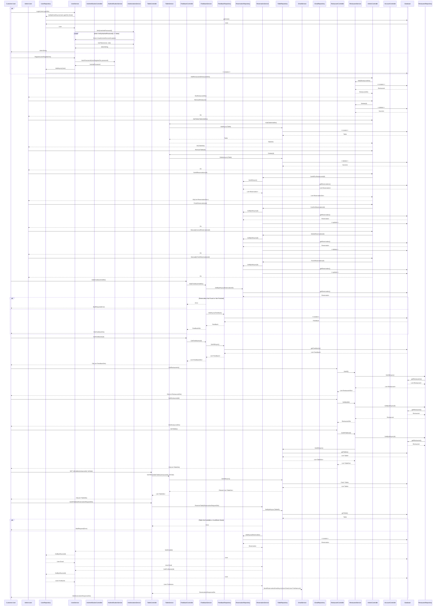

```mermaid

    sequenceDiagram
    participant Customer as Customer:User
    participant Admin as Admin:User
    participant UserRepository as :UserRepository
    participant UserService as :UserService
    participant AuthentificationController as :AuthentificationController
    participant AuthentificationService as :AuthentificationService
    participant AuthorizationService as :AuthorizationService
    participant TableController as :TableController
    participant TableService as :TableService
    participant FeedbackController as :FeedbackController
    participant FeedbackService as :FeedbackService
    participant FeedbackRepository as :FeedbackRepository
    participant ReservationRepository as :ReservationRepository
    participant ReservationService as :ReservationService
    participant TableRepository as :TableRepository
    participant TableService as :TableService

    participant EmailService as :EmailService
    participant EmailRepository as :EmailRepository
    participant RestaurantController as :RestaurantController
    participant RestaurantService as :RestaurantService

    participant AdminController as :AdminController
    participant AccountController as :AccountController

    participant Database as :Database


    alt
    Customer-) UserService: Login(UserLoginDto)
    UserService ->> UserRepository: GetByEmailAsync(UserLoginDto.Email)
    UserRepository -) Database: getUser()
    Database ->> UserRepository: User
    UserRepository ->> UserService: User

    UserService ->> AuthorizationService: VerifyHashedPassword()
    break when VerifyHashedPassword() == false
        AuthorizationService ->> UserService: throw UnauthorizedAccessException
    end
    UserService ->> AuthorizationService: GetToken(User, role) 
    AuthorizationService ->> UserService: tokenString
    UserService ->> Customer: tokenString
    

    else

    Customer -) UserService:  Register(UserRegisterDto)
    UserService ->> AuthentificationService: HashPassword(UserRegisterDto.password)
    AuthentificationService ->> UserService: hashedPassword
    UserService -) UserRepository: AddAsync(User)
    UserRepository -) Database: <<creates>>
    
    end
    
    Admin ->> AdminController: AddRestaurant(RestaurantDto)
    AdminController ->> RestaurantService: Add(RestaurantDto)
    RestaurantService ->> Database: <<creates>>
    Database -->> RestaurantService: Restaurant
    RestaurantService -->> AdminController: RestaurantDto
    AdminController -->> Admin: Ok(RestaurantDto)

    Admin ->> AdminController: RemoveRestaurant
    AdminController ->> RestaurantService: Delete(id)
    RestaurantService ->> Database: <<delete>>
    Database -->> RestaurantService: Success
    AdminController -->> Admin: Ok

    Admin ->> AdminController: AddTable(TableAddDto)
    AdminController ->> TableService: Add(TableAddDto)
    TableService ->> TableRepository: AddAsync(Table)
    TableRepository ->> Database: <<create>>
    Database -->> TableRepository: Table
    TableRepository -->> TableService: Table
    TableService -->> AdminController: TableDto
    AdminController -->> Admin: Ok(TableDto)

    Admin ->> AdminController: RemoveTable(id)
    AdminController ->> TableService: Delete(id)
    TableService ->> TableRepository: DeleteAsync(Table)
    TableRepository ->> Database: <<delete>>
    Database -->> TableRepository: Success
    AdminController -->> Admin: Ok

    Admin ->> AdminController: GetAllReservations(id)
    AdminController ->> ReservationService: GetAllForRestaurant(id)
    ReservationService ->> ReservationRepository: GetAllAsync()
    ReservationRepository ->> Database: getReservations()
    Database -->> ReservationRepository: List<Reservation>
    ReservationRepository -->> ReservationService: List<Reservation>
    ReservationService -->> AdminController: List<ReservationDto>
    AdminController -->> Admin: Ok(List<ReservationDto>)

    Admin ->> AdminController: FinishReservation(id)
    AdminController ->> ReservationService: ConfirmReservation(id)
    ReservationService ->> ReservationRepository: GetByIdAsync(id)
    ReservationRepository ->> Database: getReservation()
    Database -->> ReservationRepository: Reservation
    ReservationService ->> Database: <<update>>
    AdminController -->> Admin: Ok

    Admin ->> AdminController: ManuallyCancelReservation(id)
    AdminController ->> ReservationService: DeleteReservation(id)
    ReservationService ->> ReservationRepository: GetByIdAsync(id)
    ReservationRepository ->> Database: getReservation()
    Database -->> ReservationRepository: Reservation
    ReservationService ->> Database: <<delete>>
    AdminController -->> Admin: Ok

    Admin ->> AdminController: ManuallyFinishReservation(id)
    AdminController ->> ReservationService: FinishReservation(id)
    ReservationService ->> ReservationRepository: GetByIdAsync(id)
    ReservationRepository ->> Database: getReservation()
    ReservationService ->> Database: <<update>>
    AdminController -->> Admin: Ok

    Customer ->> FeedbackController: Add(FeedbackAddDto)
    FeedbackController ->> FeedbackService: Add(FeedbackAddDto)
    FeedbackService ->> ReservationRepository: GetByIdAsync(ReservationID)
    ReservationRepository ->> Database: getReservation()
    Database -->> ReservationRepository: Reservation

    alt Reservation Not Found or Not Finished
        FeedbackService -->> FeedbackController: Error
        FeedbackController -->> Customer: BadRequest(Error)
    else
        FeedbackService ->> FeedbackRepository: AddAsync(Feedback)
        FeedbackRepository ->> Database: <<create>>
        Database -->> FeedbackRepository: Feedback
        FeedbackRepository -->> FeedbackService: Feedback
        FeedbackService -->> FeedbackController: FeedbackDto
        FeedbackController -->> Customer: Ok(FeedbackDto)
    end

    Customer ->> FeedbackController: GetFeedbacks(id)
    FeedbackController ->> FeedbackService: GetFeedbacks(id)
    FeedbackService ->> FeedbackRepository: GetAllAsync()
    FeedbackRepository ->> Database: getFeedbacks()
    Database -->> FeedbackRepository: List<Feedback>
    FeedbackRepository -->> FeedbackService: List<Feedback>
    FeedbackService -->> FeedbackController: List<FeedbackDto>
    FeedbackController -->> Customer: Ok(List<FeedbackDto)


    %% --- RESTAURANT WORKFLOW ---
    Customer ->> RestaurantController: GetRestaurants()
    RestaurantController ->> RestaurantService: GetAll()
    RestaurantService ->> RestaurantRepository: GetAllAsync()
    RestaurantRepository ->> Database: getRestaurants()
    Database -->> RestaurantRepository: List<Restaurant>
    RestaurantRepository -->> RestaurantService: List<Restaurant>
    RestaurantService -->> RestaurantController: List<RestaurantDto>
    RestaurantController -->> Customer: Ok(List<RestaurantDto)

    Customer ->> RestaurantController: GetRestaurant(id)
    RestaurantController ->> RestaurantService: GetById(id)
    RestaurantService ->> RestaurantRepository: GetByIdAsync(id)
    RestaurantRepository ->> Database: getRestaurant()
    Database -->> RestaurantRepository: Restaurant
    RestaurantRepository -->> RestaurantService: Restaurant
    RestaurantService -->> RestaurantController: RestaurantDto
    RestaurantController -->> Customer: Ok(RestaurantDto)

    Customer ->> RestaurantController: GetTables()
    RestaurantController ->> RestaurantService: GetAllTables(id)
    RestaurantService ->> RestaurantRepository: GetByIdAsync(id)
    RestaurantRepository ->> Database: getRestaurant()
    Database -->> RestaurantRepository: Restaurant
    RestaurantService ->> TableRepository: GetAllAsync()
    TableRepository ->> Database: getTables()
    Database -->> TableRepository: List<Table>
    TableRepository -->> RestaurantService: List<TableDto>
    RestaurantService -->> RestaurantController: List<TableDto>
    RestaurantController -->> Customer: Ok(List<TableDto)


    %% --- TABLE WORKFLOW ---
    Customer ->> TableController: GET /all-tables(restaurantId, forDate)
    TableController ->> TableService: GetAllAvailableTables(restaurantId, forDate)
    TableService ->> TableRepository: GetAllAsync()
    TableRepository ->> Database: Fetch Tables
    Database -->> TableRepository: List<Table>
    TableRepository -->> TableService: Filtered List<TableDto>
    TableService -->> TableController: List<TableDto>
    TableController -->> Customer: Ok(List<TableDto)

    Customer ->> TableController: GetAllTables(ReservationRequestDto)
    TableController ->> ReservationService: ReserveTable(ReservationRequestDto)
    ReservationService ->> TableRepository: GetByIdAsync(TableID)
    TableRepository ->> Database: getTable()
    Database -->> TableRepository: Table

    alt Table Not Available or Insufficient Seats
        ReservationService -->> TableController: Error
        TableController -->> Customer: BadRequest(Error)
    else
        ReservationService ->> ReservationRepository: AddAsync(Reservation)
        ReservationRepository ->> Database: <<create>>
        Database -->> ReservationRepository: Reservation
        ReservationRepository -->> ReservationService: Reservation
        ReservationService -->> UserService: GetEmail(id)
        UserService -->> UserRepository: GetByIdAsync(id)
        UserRepository -->> Database: User
        UserRepository -->> UserService: User.Email
        UserService -->> ReservationService: User.Email

       ReservationService -->> UserService: GetFirstName(id)
        UserService -->> UserRepository: GetByIdAsync(id)
        UserRepository -->> Database: User
        UserRepository -->> UserService: User.FirstName
        UserService -->> ReservationService: User.FirstName

        ReservationService -->> EmailService: SendReservationEmailAsync(User.Email,User.FirstName,id)

        ReservationService -->> TableController: ReservationResponseDto
        TableController -->> Customer: Ok(ReservationResponseDto)
    end

```