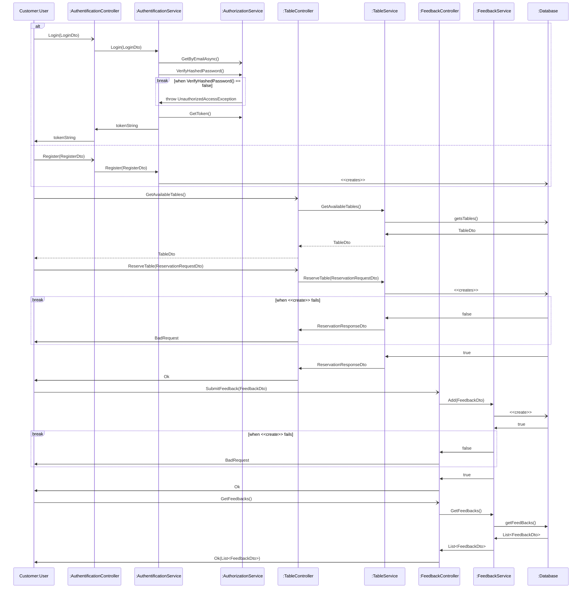

```mermaid

    sequenceDiagram
    participant Customer as Customer:User
    participant AuthentificationController as :AuthentificationController
    participant AuthentificationService as :AuthentificationService
    participant AuthorizationService as :AuthorizationService
    participant TableController as :TableController
    participant TableService as :TableService
    participant FeedbackController as :FeedbackController
    participant FeedbackService as :FeedbackService
    participant Database as :Database


    alt
    Customer-)AuthentificationController: Login(LoginDto)
    AuthentificationController ->> AuthentificationService: Login(LoginDto) 
    AuthentificationService -) AuthorizationService: GetByEmailAsync()
    AuthentificationService ->> AuthorizationService: VerifyHashedPassword()
    break when VerifyHashedPassword() == false
        AuthorizationService ->> AuthentificationService: throw UnauthorizedAccessException
    end
    AuthentificationService ->> AuthorizationService: GetToken()
    AuthentificationService ->> AuthentificationController: tokenString
    AuthentificationController ->> Customer: tokenString

    else

    Customer -) AuthentificationController:  Register(RegisterDto)
    AuthentificationController ->> AuthentificationService: Register(RegisterDto)
    AuthentificationService -) Database: <<creates>>
    
    end
    
    Customer -) TableController: GetAvailableTables()
    TableController ->> TableService: GetAvailableTables()
    TableService -) Database: getsTables()
    Database ->> TableService: TableDto
    TableService -->> TableController: TableDto
    TableController -->> Customer: TableDto

    Customer -) TableController: ReserveTable(ReservationRequestDto)
    TableController ->> TableService: ReserveTable(ReservationRequestDto)
    TableService -) Database: <<creates>>
    break when <<create>> fails
    Database ->> TableService: false
    TableService ->> TableController: ReservationResponseDto
    TableController ->> Customer: BadRequest
    end
    Database ->> TableService: true
    TableService ->> TableController: ReservationResponseDto
    TableController ->> Customer: Ok


    Customer -) FeedbackController: SubmitFeedback(FeedbackDto)
    FeedbackController ->> FeedbackService: Add(FeedbackDto)
    FeedbackService -) Database: <<create>>
    Database ->> FeedbackService: true
    break when <<create>> fails
    FeedbackService ->> FeedbackController: false
    FeedbackController ->> Customer : BadRequest
    end
    FeedbackService ->> FeedbackController: true
    FeedbackController ->> Customer: Ok

    Customer -) FeedbackController: GetFeedbacks()
    FeedbackController ->> FeedbackService: GetFeedbacks()
    FeedbackService ->> Database: getFeedBacks()
    Database ->> FeedbackService: List<FeedbackDto>
    FeedbackService ->> FeedbackController: List<FeedbackDto>
    FeedbackController ->> Customer: Ok(List<FeedbackDto>)


```