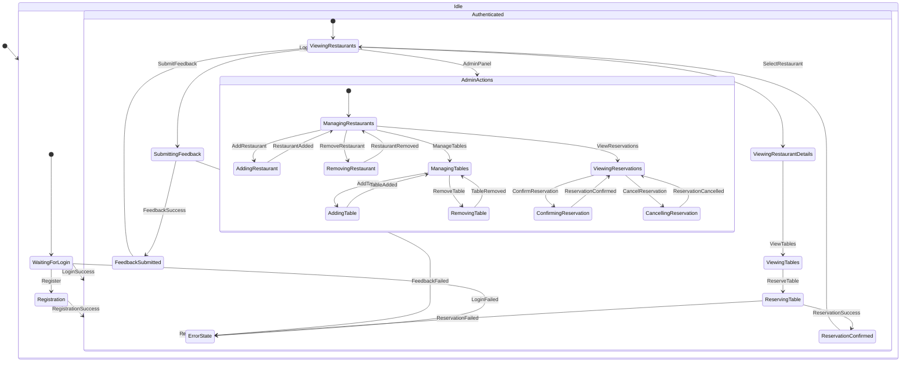

```mermaid

stateDiagram-v2
    [*] --> Idle

    state Idle {
        [*] --> WaitingForLogin
        WaitingForLogin --> Authenticated : LoginSuccess
        WaitingForLogin --> Registration : Register
        Registration --> Authenticated : RegistrationSuccess
        WaitingForLogin --> ErrorState : LoginFailed
    }

    state Authenticated {
        [*] --> ViewingRestaurants

        ViewingRestaurants --> ViewingRestaurantDetails : SelectRestaurant
        ViewingRestaurantDetails --> ViewingTables : ViewTables
        ViewingTables --> ReservingTable : ReserveTable

        ReservingTable --> ReservationConfirmed : ReservationSuccess
        ReservingTable --> ErrorState : ReservationFailed

        ViewingRestaurants --> SubmittingFeedback : SubmitFeedback
        SubmittingFeedback --> FeedbackSubmitted : FeedbackSuccess
        SubmittingFeedback --> ErrorState : FeedbackFailed

        ViewingRestaurants --> AdminActions : AdminPanel
    }

    state AdminActions {
        [*] --> ManagingRestaurants

        ManagingRestaurants --> AddingRestaurant : AddRestaurant
        AddingRestaurant --> ManagingRestaurants : RestaurantAdded
        ManagingRestaurants --> RemovingRestaurant : RemoveRestaurant
        RemovingRestaurant --> ManagingRestaurants : RestaurantRemoved

        ManagingRestaurants --> ManagingTables : ManageTables
        ManagingTables --> AddingTable : AddTable
        AddingTable --> ManagingTables : TableAdded
        ManagingTables --> RemovingTable : RemoveTable
        RemovingTable --> ManagingTables : TableRemoved

        ManagingRestaurants --> ViewingReservations : ViewReservations
        ViewingReservations --> ConfirmingReservation : ConfirmReservation
        ConfirmingReservation --> ViewingReservations : ReservationConfirmed
        ViewingReservations --> CancellingReservation : CancelReservation
        CancellingReservation --> ViewingReservations : ReservationCancelled
    }

    ReservationConfirmed --> ViewingRestaurants
    FeedbackSubmitted --> ViewingRestaurants
    ErrorState --> Idle : Retry
    ViewingRestaurants --> Idle : Logout

```